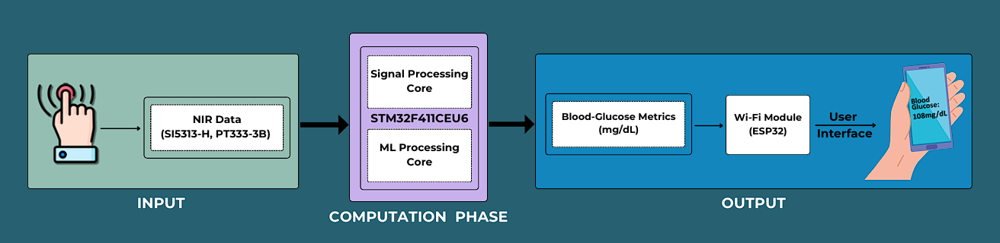
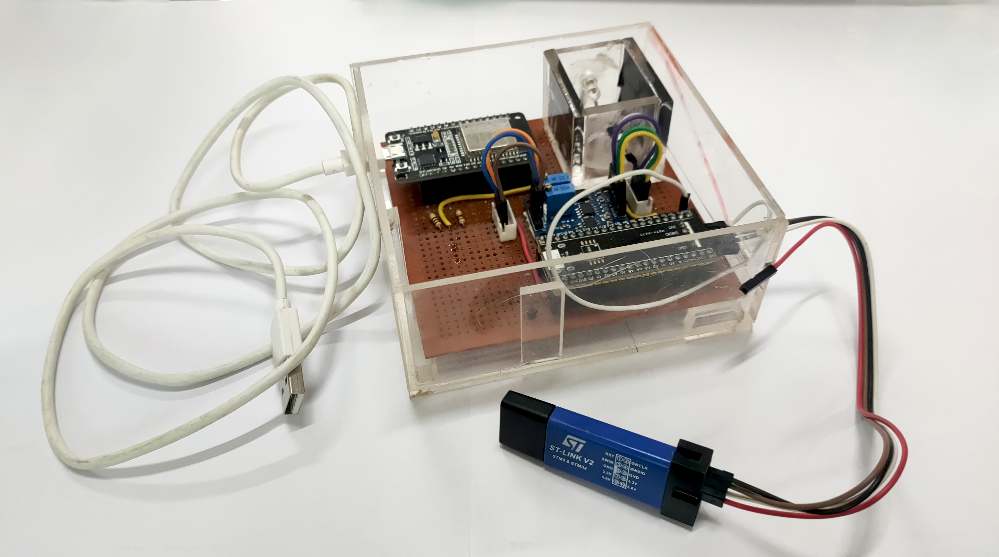

# GlucoRoko – Non-Invasive Blood Glucose Monitoring System

**GlucoRoko** is a real-time, non-invasive blood glucose monitoring system that uses Near-Infrared (NIR) Spectroscopy, advanced signal processing, and embedded machine learning to provide painless glucose level estimation. It is designed for preventive health monitoring and features seamless integration with a mobile app for logging and tracking.

---

## Overview

The system allows users to place a finger between an IR emitter and photodiode. The NIR light signal modulated by blood glucose concentration is amplified and processed using an STM32 microcontroller. Predicted glucose values are transmitted to a Firebase cloud database via an ESP32 module, then visualized in a dedicated Android app.

---

## Block Diagram

*Upload your system block diagram image below:*

---

## Key Features

- Non-invasive glucose detection using NIR spectroscopy  
- Real-time prediction using STM32 with onboard regression model  
- Firebase-based cloud sync using ESP32  
- Android app with historical data logging and intuitive UI  
- Eliminates pain, recurring costs, and infection risks of finger-prick methods

---

## Core Hardware Components

- **SI5313-H (IR LED)** – 950nm NIR emission  
- **PT333-3B (Photodiode)** – Signal detection  
- **AD620** – Instrumentation amplifier  
- **STM32F411CEU6** – Signal acquisition, processing, and regression  
- **ESP32** – Wi-Fi transmission to Firebase  

---

## App Features

- Displays real-time blood glucose reading  
- Personalized greeting after first login  
- Logs previous 100 readings with timestamps  
- Clean UI built using Node.js and Firebase  

---

## System Flow

1. User places finger between IR emitter and receiver  
2. Signal is amplified and digitized using STM32’s ADC  
3. Glucose level is predicted using a regression model or LUT  
4. ESP32 uploads the result to Firebase  
5. App fetches and displays the latest reading  

---

## Results

- Regression Model Range: 70–140 mg/dL  
- RMSE: **15.33 mg/dL**  
- Lookup Table used above 150 mg/dL  
- Data collected in clinical setting for reference validation  

---

## Final Prototype

*Upload your final prototype image below:*

---

## Achievements

- Finalist – **ACCS Advanced Design Challenge (ADC-2024)**  
- Recognized for innovation in embedded health-tech applications

---

## Team

- [Anirudh Navalgund](https://github.com/Anirudh-Navalgund)  
- [E Sujaya](https://github.com/Sujaya-E)
- Diksha Shetty

---

> GlucoRoko bridges the gap between comfort, affordability, and medical precision — a step forward in non-invasive diabetic healthcare.
